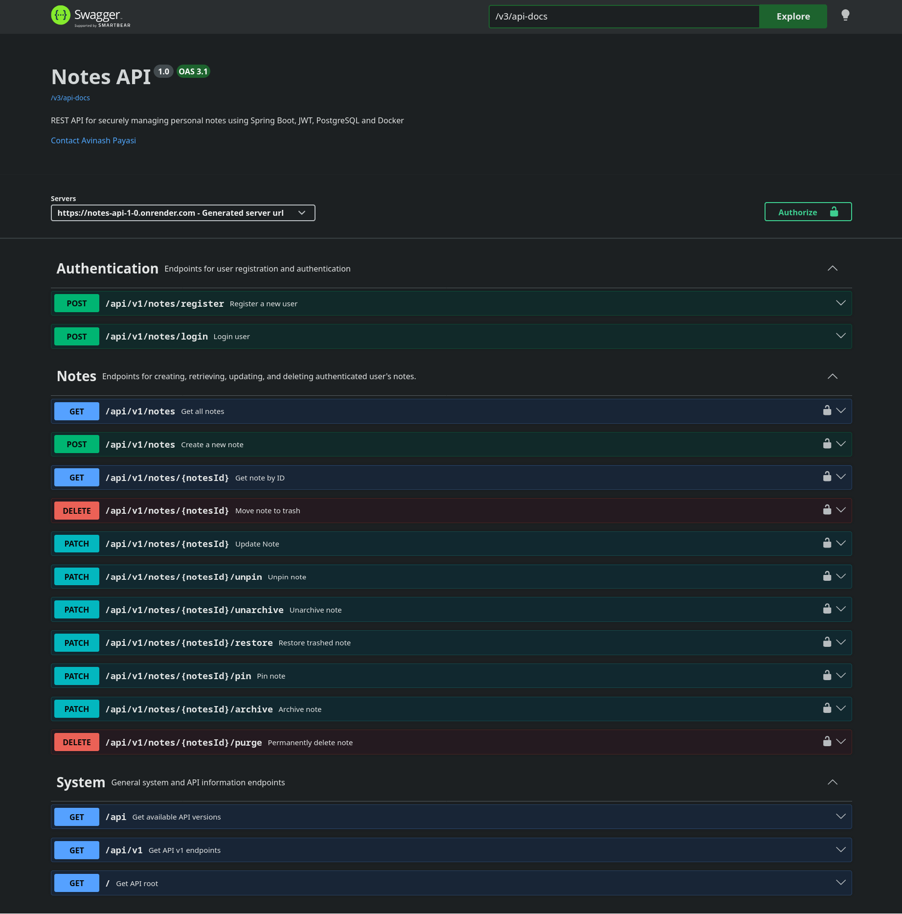
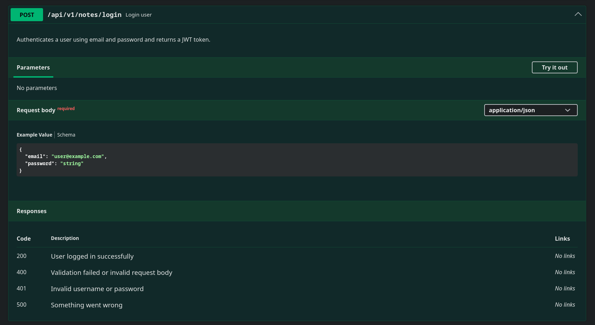
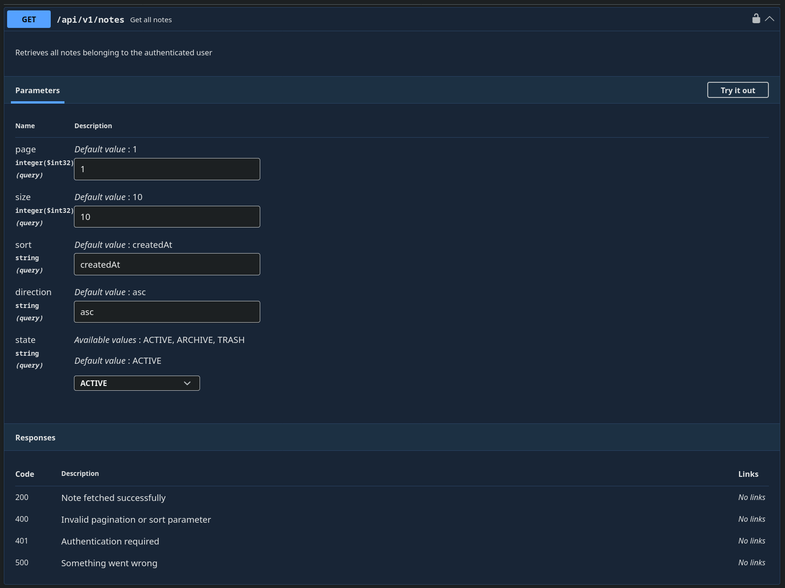
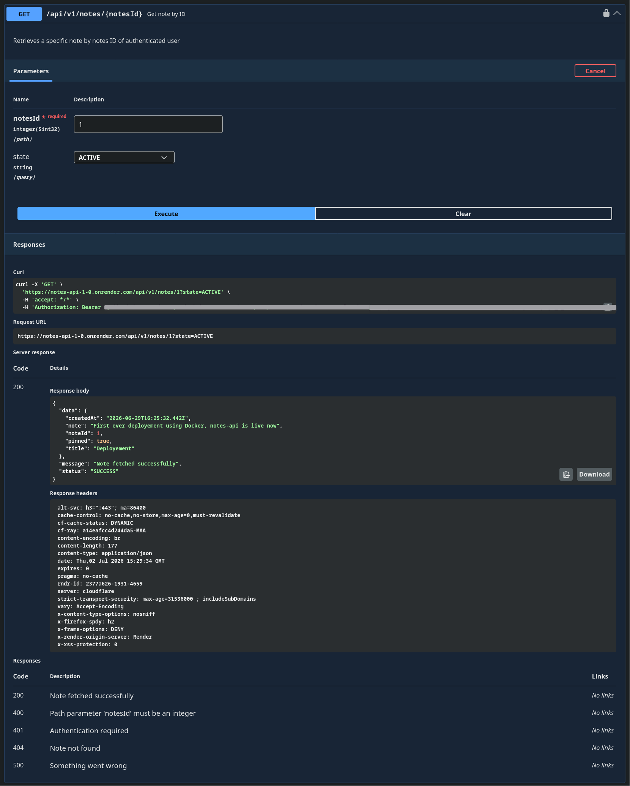

# Notes API


A backend-focused REST API for securely managing personal notes using **Spring Boot**, **Spring Security**, **JWT**, and **PostgreSQL**.

The project focuses on production-oriented backend development practices including authentication, authorization, state-based resource management, pagination, validation, exception handling, API documentation, and layered architecture.

---

## Live Demo

- **Live API:** https://notes-api-1-0.onrender.com
- **Swagger UI:** https://notes-api-1-0.onrender.com/swagger-ui/index.html

---

## Screenshots

### Swagger UI



### Login Endpoint



### Get Notes



### Fetch Note by ID (Successful Response)



---

## Project Overview

Notes API is a REST backend that allows users to register, authenticate using JWT, and securely manage their personal notes.

The application provides:

- Secure JWT authentication
- User-isolated note access
- Note lifecycle management
- Pagination and sorting
- Validation
- Centralized exception handling
- Consistent API responses
- OpenAPI documentation

The API is versioned and exposes system endpoints:

- `GET /`
- `GET /api`
- `GET /api/v1`

---

## Key Features

- JWT Authentication
- BCrypt password hashing
- Stateless Spring Security
- User-isolated note access
- ACTIVE / ARCHIVE / TRASH note lifecycle
- Soft delete
- Restore
- Permanent delete
- Pin / Unpin
- Archive / Unarchive
- Pagination
- Sorting
- State filtering
- Validation
- Global exception handling
- Consistent API response wrapper
- Swagger/OpenAPI documentation
- Trailing slash handling

---

## Tech Stack

- Java 21
- Spring Boot
- Spring Web MVC
- Spring Security
- Spring Data JPA
- PostgreSQL
- JWT Authentication
- Jakarta Validation
- Swagger/OpenAPI
- Docker
- Maven

---

## Project Structure

```text
src/main/java

├── config
├── controller
├── dto
├── entity
│   └── enums
├── exception
├── repository
├── security
├── service
├── convertor
└── NotesSystemApplication
```

---

## Architecture

```text
               Client

                  │

                  ▼

         Spring Security

                  │

                  ▼

      JWT Authentication Filter

                  │

                  ▼

             Controller

                  │

                  ▼

              Service

                  │

                  ▼

            Repository

                  │

                  ▼

            PostgreSQL
```

---

## Authentication Flow

### Registration

- Register with email and password
- Email uniqueness validation
- Password cannot match email
- Password stored using BCrypt

### Login

- Authenticate using Spring Security
- JWT generated on successful login
- JWT subject stores authenticated user's UUID

### Protected Routes

Every `/api/v1/notes/**` endpoint (except login/register) requires:

```http
Authorization: Bearer <JWT_TOKEN>
```

---

## Note Lifecycle

Each note belongs to one authenticated user.

```
ACTIVE
   │
   ├────────► ARCHIVE
   │              │
   │              ▼
   │          UNARCHIVE
   │
   ▼
TRASH
   │
   ├────────► RESTORE
   │
   ▼
PERMANENT DELETE
```

Business Rules:

- Notes start as ACTIVE
- Trash notes cannot be pinned
- Trash notes cannot be archived
- Soft delete removes pin
- Permanent delete only works for TRASH notes

---

## API Endpoints

### Authentication

| Method | Endpoint | Description |
|--------|-----------|-------------|
| POST | `/api/v1/notes/register` | Register user |
| POST | `/api/v1/notes/login` | Login user |

---

### Notes

| Method | Endpoint | Description |
|--------|-----------|-------------|
| GET | `/api/v1/notes` | Fetch paginated notes with filtering and sorting |
| POST | `/api/v1/notes` | Create note |
| GET | `/api/v1/notes/{noteId}` | Fetch note by ID |
| PATCH | `/api/v1/notes/{noteId}` | Update note |
| DELETE | `/api/v1/notes/{noteId}` | Move note to trash |
| PATCH | `/api/v1/notes/{noteId}/restore` | Restore trashed note |
| DELETE | `/api/v1/notes/{noteId}/purge` | Permanently delete note |

---

### Note State Operations

| Method | Endpoint | Description |
|--------|-----------|-------------|
| PATCH | `/api/v1/notes/{noteId}/pin` | Pin note |
| PATCH | `/api/v1/notes/{noteId}/unpin` | Unpin note |
| PATCH | `/api/v1/notes/{noteId}/archive` | Archive note |
| PATCH | `/api/v1/notes/{noteId}/unarchive` | Unarchive note |

---

## Pagination & Sorting

The API supports:
- Pagination
- Sorting
- Direction-based ordering

Supported query parameters:
- `page`
- `size`
- `sort`
- `direction`
- `state`

---

## Request / Response Examples

### Register User

```http
POST /api/v1/notes/register
Content-Type: application/json

{
  "email": "user@example.com",
  "password": "password123"
}
```

---

### Login User

```http
POST /api/v1/notes/login
Content-Type: application/json

{
  "email": "user@example.com",
  "password": "password123"
}
```
---

### Create Note

```http
POST /api/v1/notes
Authorization: Bearer <JWT_TOKEN>
Content-Type: application/json

{
  "title": "Spring Notes",
  "note": "Learning backend engineering"
}
```

### Fetch Note by ID

**Request**

```http
GET /api/v1/notes/1
Authorization: Bearer <JWT_TOKEN>
```

**Response**

```json
{
  "status": "SUCCESS",
  "message": "Note fetched successfully",
  "data": {
    "noteId": 1,
    "title": "Spring Notes",
    "note": "Learning backend engineering",
    "pinned": false,
    "state": "ACTIVE",
    "createdAt": "2026-07-02T12:00:00Z"
  }
}
```

---

## Validation & Exception Handling

- Request validation
- Global exception handling
- Consistent API response structure
- Proper HTTP status codes

---

## Setup

### 1. Clone the Repository

```bash
git clone https://github.com/AvinashPayasi/notes-system.git
cd notes-system
```

---

### 2. Configure Environment Variables

Before running the application, configure the following environment variables:

| Variable | Description |
|----------|-------------|
| `DB_HOST` | PostgreSQL host |
| `DB_PORT` | PostgreSQL port |
| `DB_NAME` | Database name |
| `DB_USERNAME` | PostgreSQL username |
| `DB_PASSWORD` | PostgreSQL password |
| `JWT_SECRET_KEY` | Base64-encoded JWT signing key |
| `JWT_EXPIRATION_TIME` | JWT expiration time in milliseconds |

Example:

```bash
DB_HOST=localhost
DB_PORT=5432
DB_NAME=notes_system
DB_USERNAME=postgres
DB_PASSWORD=your_password

JWT_SECRET_KEY=your_base64_secret
JWT_EXPIRATION_TIME=86400000
```

---

### 3. Run the Application

```bash
./mvnw -pl notes-api spring-boot:run
```

The application starts on:

```text
http://localhost:8080
```

---

## API Documentation

Swagger/OpenAPI is integrated into the project.

Features include:

- JWT authentication support
- Operation summaries
- Request documentation
- Response documentation
- Bearer authentication configuration

Swagger UI:

```
/swagger-ui/index.html
```

---

## Future Improvements

### Security

- Refresh Tokens
- Login Rate Limiting

### Features

- Full-text search
- Labels / Categories

### Quality

- Unit Testing
- Integration Testing
- Improved validation messages

### DevOps

- CI/CD Pipeline

### Observability

- Structured Logging
- Monitoring & Metrics

---

## What I Learned

Building this project provided hands-on experience with:

- Spring Security
- Stateless JWT Authentication
- Layered Architecture
- Spring Data JPA
- PostgreSQL
- DTO Mapping
- Pagination
- REST API Design
- Exception Handling
- OpenAPI Documentation
- User-specific resource authorization
- State-driven business logic

---

Built to strengthen backend engineering skills through practical implementation of secure REST APIs using Spring Boot.